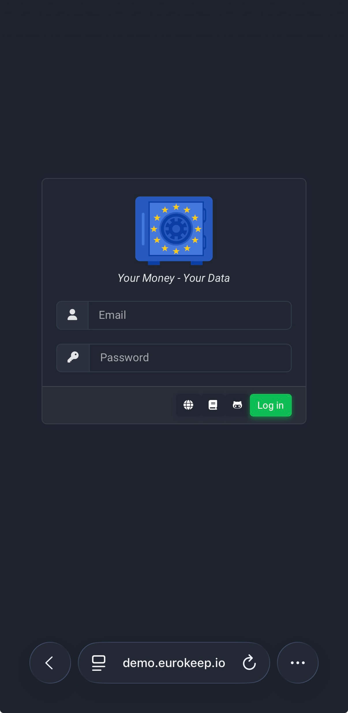
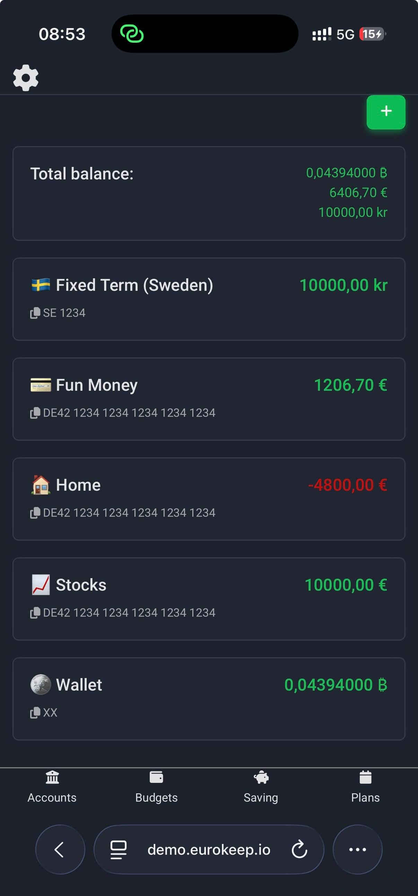
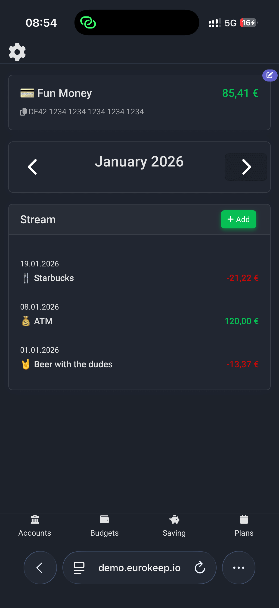
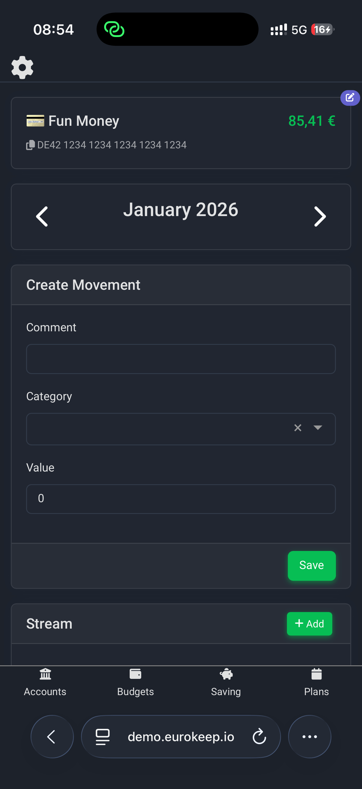

# EuroKeep Test Package
This is the minimal code for the EuroKeep project.

For now, it is sufficient, since there is not a build or release, yet.

## Installation
Our installer is yet to come. Stay tuned for updates.

## Demo
See EuroKeep in action at our [Demo](https://demo.eurokeep.io/).

Log in with

- email: ``demo@eurokeep.io``
- passw: ``ZRkjSNR3696bwUesuV``

## Screenshots

